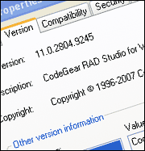

# VersionInfo for Delphi



The **amVersionInfo** library basically just wraps the Win32 `GetFileVersionInfo` (and related) API functions. The library makes it very easy to read  values from the Version Info resource of Windows executables and DLLs.

## Features

- Reads all integer version info values:
  File version, product version, File flags, OS, file type, file sub-type, and file date.
- Reads any named version info string value such as:
  Product Name, Product Version, Company, Copyright, etc.
- Supports languages, character sets and translations.

### The TVersionInfo class

The `TVersionInfo` class contains the core functionality of the library. The following is the public interface of the class:

```pascal
TApplicationVersion = class
public
  constructor Create(const Filename: string);
  destructor Destroy; override;
  class function VersionToString(Version: int64): string;
  class function StringToVersion(const Value: string): int64;
  class function VersionMajor(Version: int64): Word;
  class function VersionMinor(Version: int64): Word;
  class function VersionRelease(Version: int64): Word;
  class function VersionBuild(Version: int64): Word;
  class function FileVersionString(const Filename: string): string;
  function GetString(const Key: string; LanguageID: integer; CharsetID: integer): string; overload;
  function GetString(const Key, TranslationID: string): string; overload;
  function GetString(const Key: string; Index: integer = 0): string; overload;
  property Valid: boolean read FValid;
  property Strings[const Key: string]: string read DoGetString; default;
  property FileVersion: int64 read GetFileVersion;
  property ProductVersion: int64 read GetProductVersion;
  property FileFlags: DWORD read GetFileFlags;
  property OS: DWORD read GetOS;
  property FileType: DWORD read GetFileType;
  property FileSubType: DWORD read GetFileSubType;
  property FileDate: int64 read GetFileDate;
  property LanguageID[Index: integer]: WORD read GetLanguage;
  property CharsetID[Index: integer]: WORD read GetCharset;
  property LanguageNames[Index: integer]: string read GetLanguageName;
  property TranslationCount: integer read FTranslationCount;
end;
```

## Examples

### Example 1

Display the application version number in a message box.

```pascal
uses
  amVersionInfo;

...

begin
  ShowMessage(TVersionInfo.FileVersionString(Application.ExeName));
end;
```

### Example 2

Set the application title to the description value specified in the version resource.

```pascal
uses
  amVersionInfo;

...

var
  VersionInfo: TVersionInfo;
begin
  VersionInfo := TVersionInfo.Create(Application.ExeName);
  try
    Application.Title := VersionInfo['FileDescription'];
  finally
    VersionInfo.Free;
  end;
end;
```
